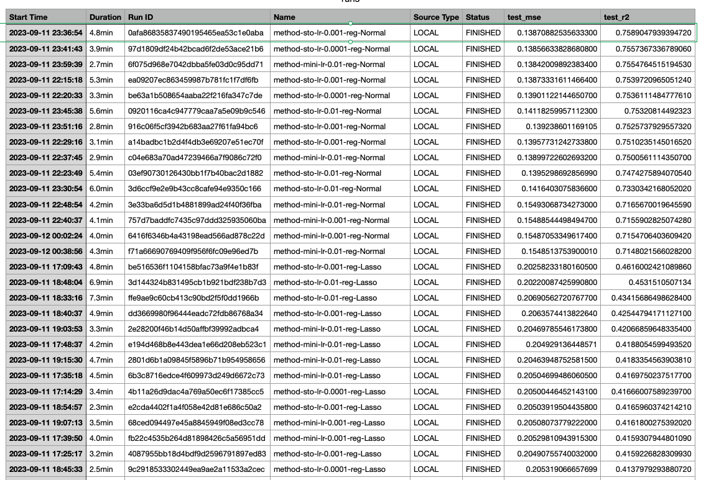

# Selling Price Prediction for cars

- [Selling Price Prediction of cars](#price-prediction-of-cars)

 
  - [Overview](#overview)
    - [Dataset Descrption](#dataset-descrption)
  - [Key technical aspects](#key-technical-aspects)
  - [Best Model selection](#best-model-selection)
    - [Metric](#metric)
    - [Best parametes](#best-parametes)
    - [Evaluation](#evaluation) 
    - [Feature importances](#feature-importances)
   - [Environment Setup](#environment-setup)


## Overview


In this assignment, We need to predict the **selling price for a car** . Finally, we also need to prepare a simple web-based car selling price prediction system for deployment.

### Dataset Descrption


The provide raw data contains following features- 

- **name** : Brand name of the Car
- **Year** : Year of the car made
- **selling_price**: Selling price of the car
- **km_driven**: How many Killometers A car already run
- **fuel**: Type of fuel is used in car
- **seller_type**: Type of seller (Invididual, Dealer etc)
- **transmission**: Type of transmission of car ( Manual, Automatic)
- **owner**: How many owner already did purchase of a car
- **mileage**: Mileage of the car
- **engine**: Engine size
- **max_power**: The max power is available to a car
- **torque**:if an engine has a lot of torque, the car can accelerate more quickly.
- **seats**: Number of seats are availabe to a car

This raw dataset is required to be processed on a set of given requirements. 

After fulfilling all the dataset processing requirements, the final data distribution is looked like the following figures-

After processing the final data distribution is looked like the following figures-

**The Raw Dataset**


The  Dataset after fulfilling all the processing requirements 


**Categorical data distribution**


**Numerical data distribution**


##  key technical aspects 

After thorough data exploration and visualization, several data preprocessing steps are chosen to prepare the dataset for modeling. Here are some notable aspects of the process:

- The feature ```name``` is renamed to ```brand```, and since there are 32 unique car brands in the dataset, we drop the ```brand``` feature due to the high number of categories compared to the dataset size.


- The target variable ```selling_price``` is Log transformed to make their distribution symetrical.

- Categorical variables like ```fuel_Type```, ```transmission```, and ```seller_type``` are ```one-hot encoded``` to convert them into numerical format suitable for machine learning algorithms.

- The ```year``` column is used to calculate the ```age``` of each car by subtracting the current year from the maximum year in the dataset, effectively introducing an 'aging effect'. The new feature ```age``` is then added to the dataset. And we drop the ```year``` column from the dataset.

- Based on exploratory data analysis (EDA) insights, domain knowledge, and correlation analysis, the following features are selected for modeling
[```km_driven```,```age```,``engine``,```fuel_Petrol```,```transmission_Manual```]
- The dataset is split into training and testing sets using the  ```train_test_split``` function from the ```sklearn.model_selection``` module

-  To ensure consistent scaling, the numerical features in both the training and testing sets are standardized using the ```StandardScaler``` from ```sklearn.preprocessing ```module. Standardization helps models perform better by ensuring that features are on a similar scale.

These technical aspects represent the key steps taken to preprocess the data and prepare it for various regression algorithms. The steps are chosen based on data characteristics, domain knowledge, and best practices to ensure optimal model performance.

The Correlation Matrix of the features- 


- **Train & Test Data distribution**
  - Total Dataset Size 8028
  - Training Dataset Size 5619 (``70%``)
  - Test Dataset Size 2409 (``30%``)


## Best Model selection

### Metric 

* **Mean Squared Error** (MSE) and **R^2**  are used as metrice.

* MSE measures the average squared difference between the predicted and actual values. It gives us an idea of how close the predicted values are to the actual values. Lower MSE indicates better model performance.

* R^2 is a value between 0 and 1 where
     - 0 inidicates model does not explain any of the variability in the target variable.
     - 1 indicate that the model perfectly explains the variability in the target variable.


We check the following each of the combination - 
```
 - regs = ["Polynomial", "Lasso", "Ridge",'Normal']
 - init_thetas = ['zero','xavier']
 - methods = ['batch', 'sto','mini']
 - momentums = [0, 0.7]
 - lr_li =  [0.01, 0.001, 0.0001]
```
From MLFLOW logs checking, among 101 various runs based on the above all the configuration. 

Finally, we come with the **Normal Linear Regression model** works better in our case with  below configuratrion- 
```
 - Method: stochastic 
 - Momentum: 0 
 - Theta Init: xavier 
 - Learning Rate: 0.001
 ```
 The choosen **Normal Linear Regression model**'s Accuracy- 
  - MSE 0.13870882535633300
  - R^2 0.7589047939394720


### Evaluation

It seems a test MSE of 0.13870882535633255 and a test R^2 score of 0.7589047939394724 can be considered good in many cases, but the ultimate judgment should be based on the unique characteristics and requirements of the problem.

#### Some of the runs from MLFLOW and the comparison of various runs with their test mse and r^2 scores



### Feature importances

**Still we  have scope to improve the model and We encountered that transmission_Manual has highest influence on selling price.**

**Age has an positive influence on the selling price**

**Fuel_Petrol, engine, km_driven has a negative influnce on the selling price of a car**


### A summary

#### Findings
- We chose the model configuration with regularization set to "Normal," the optimization method as "sto" (which is likely stochastic gradient descent), a momentum value of 0, Xavier initialization for weight initialization, and a learning rate of 0.001. 
- This choice was made based on a comprehensive evaluation of the model's performance using cross-validation. The model demonstrated consistent and relatively low Mean Squared Error (MSE) across all folds, with values ranging from 0.1376 to 0.1515, indicating good predictive accuracy. 
- Moreover, the test MSE of 0.1387 and an R-squared (R2) value of 0.7589 on the test data show that this configuration generalizes well to unseen data, capturing about 75.89% of the variance in the target variable.

#### Future improvements
There are several strategies to consider
- Firstly, hyperparameter tuning could be explored further to find even better combinations of regularization strength, learning rate, and other hyperparameters. This could potentially lead to a model with improved predictive performance. Additionally, feature engineering techniques might be employed to extract more meaningful information from the input data, potentially enhancing the model's ability to capture underlying patterns. 
- Furthermore, the dataset itself should be scrutinized for any potential outliers or noisy data points that might be impacting model performance, and data preprocessing steps could be refined to address these issues.


## Environment Setup


To set up the environment for running the car selling price prediction Assignment, follow these steps:
 1. Install Python: Ensure  Python version 3.8.17 or above
 2. Install Required Packages
 ```pip install numpy==1.24.3
    pip install pandas==1.5.3
    pip install seaborn==0.12.2
    pip install matplotlib==3.7.2
    pip install scikit-learn==1.2.2
    pip install dash
    pip install dash_bootstrap_components
    pip install mlflow
```

### Dash App Deployment 

All the files reqiured for setting up Dash deployment are in ```app/code``` directory. Dash Application contains 2 models ( one from Assignment A1 and current One). User are flexible to choose any of them. Need to open the terminal and navigate to the directory ```app/code```. Finally run the below command.

 ```
 python main.py
 ```

 Then, access the Dash Application: Once the script is running, open a web browser and visit **http://localhost:8050/**  to access the car selling price prediction web application.


 

 ### Docker Compose to run the app in a Docker container
Need to open terminal or command prompt and navigate to ```app`` directory where the docker-compose.yml and Dockerfile are located. And run the below command 


``````sh
docker compose up --build

```````

Access the app with **http://localhost:9001**


#### For a live demo please visit **https://web-st124047.ml2023.cs.ait.ac.th/**